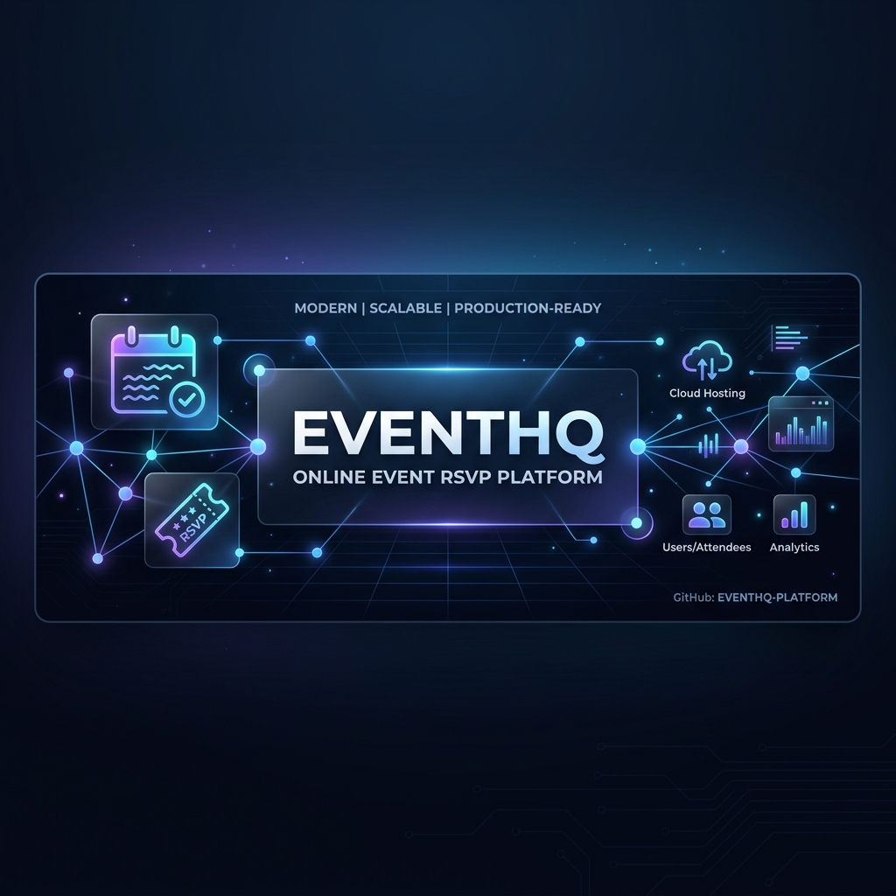
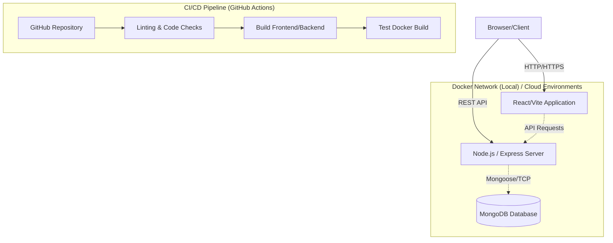

<div align="center">
  

  <h1>EventHub: Online Event RSVP Platform</h1>
  
  <p>
    <strong>A full-stack, scalable, and cloud-ready MERN application for managing event registrations.</strong>
  </p>

  <p>
    
    
    
    
    
    
  </p>
</div>

---

## 🌟 Overview

EventHub is a professional, responsive, and secure platform that allows users to discover events and RSVP seamlessly. Built with modern web development standards in mind, the application features an isolated containerized architecture using Docker, automated CI/CD via GitHub Actions, and production-ready configurations for cloud deployment.

## 🚀 Tech Stack

### Frontend
- **React.js** (Vite) for a lightning-fast UI.
- **Tailwind CSS** for clean, responsive, and modern styling.
- **Axios** for handling secure API requests.

### Backend
- **Node.js & Express.js** providing a robust RESTful API.
- **MongoDB** (with Mongoose) for flexible NoSQL data storage.
- **JWT & express-session** for secure authentication.

### DevOps & Infrastructure
- **Docker & Docker Compose** for isolated, reproducible local environments.
- **Nginx** serving the frontend React application inside Docker.
- **GitHub Actions** for Continuous Integration & Deployment (CI/CD).

---

## 🏗️ Architecture Overview



---

## ⚙️ Local Setup Instructions

You can run this project locally using either **Docker** (recommended) or native **Node.js**.

### Method 1: Docker (Recommended)
Make sure you have Docker Desktop running.

1. Clone the repository and navigate into it.
2. Run the following command:
   ```bash
   docker-compose up --build -d
   ```
3. The application will build and start three containers: MongoDB, the Node.js backend, and the Vite/Nginx frontend.
4. Access the application at **http://localhost:5173**.

### Method 2: Standard Node.js
If you prefer not to use Docker, ensure you have MongoDB running locally on port `27017`.

**1. Start the Backend:**
```bash
cd server
npm install
npm run dev
```

**2. Start the Frontend:**
Open a new terminal.
```bash
cd client
npm install
npm run dev
```

---

## 🔄 CI/CD Workflow

This repository utilizes **GitHub Actions** to automate quality assurance and deployment readiness.

Every push or pull request to the `main` branch triggers the following automated pipeline (`.github/workflows/deploy.yml`):
1. **Environment Setup:** Provisions a cloud server with Node.js 20.
2. **Frontend Checks:** Installs dependencies, runs code linters (`npm run lint`), and builds the static assets to ensure the UI is error-free.
3. **Backend Checks:** Installs backend packages and verifies dependency integrity.
4. **Integration Checks:** Executes a full `docker-compose build` to verify the entire system can be containerized successfully.

This guarantees that **broken code never reaches the production server**.

---

## ☁️ Cloud Deployment Guide

This project is fully configured for modern PaaS (Platform as a Service) providers.

### 1. Database (MongoDB Atlas)
1. Create a free cluster on [MongoDB Atlas](https://www.mongodb.com/cloud/atlas).
2. Set network access to `0.0.0.0/0` (Allow from anywhere).
3. Get your connection string (e.g., `mongodb+srv://<username>:<password>@cluster.mongodb.net/eventhub`).

### 2. Backend (Render.com)
This project includes a `render.yaml` file for Infrastructure as Code.
1. Connect your GitHub repository to [Render](https://render.com/).
2. Create a new **Web Service**.
3. Render will automatically detect the settings from `render.yaml`.
4. In the Render Dashboard, add your environment variables:
   - `MONGO_URI` (from Atlas)
   - `FRONTEND_URL` (your future Vercel URL)
5. Deploy the backend and copy the live URL (e.g., `https://rsvp-backend.onrender.com`).

### 3. Frontend (Vercel)
This project includes a `client/vercel.json` file for optimal Single-Page Application routing.
1. Connect your GitHub repository to [Vercel](https://vercel.com/).
2. Select the `client` folder as the Root Directory.
3. Vercel will auto-detect Vite.
4. Add the following Environment Variable:
   - `VITE_API_URL` = `https://rsvp-backend.onrender.com/api` (Your Render URL)
5. Click **Deploy**.

---

> Built with ❤️ by a passionate Full-Stack Developer aiming for clean, scalable, and professional code.
